# 基于supermap iserver的长春市公共服务平台
## 1. 简介
基于Vue的quasar框架编写，使用supermap iserver提供的地图服务和数据服务，实现了长春市地图的展示和查询功能。
## 2. 运行环境的配置
### 2.1 安装node.js
在node.js官网 (https://nodejs.org/zh-cn/download/package-manager) 下载安装包，安装node.js
### 2.2 安装依赖包
进入包含package.json的目录，执行npm install命令，安装依赖包
```bash
npm install
```
### 2.3 启动项目
进入包含package.json的目录，执行npm run dev命令，启动项目
```bash
npm run dev
```
### 2.4 配置supermap iserver的地图服务和数据服务
1. 注册supermap iserver账号，下载安装包，安装supermap iserver
2. 启动supermap iserver
### 2.5 运行成功
结果如下
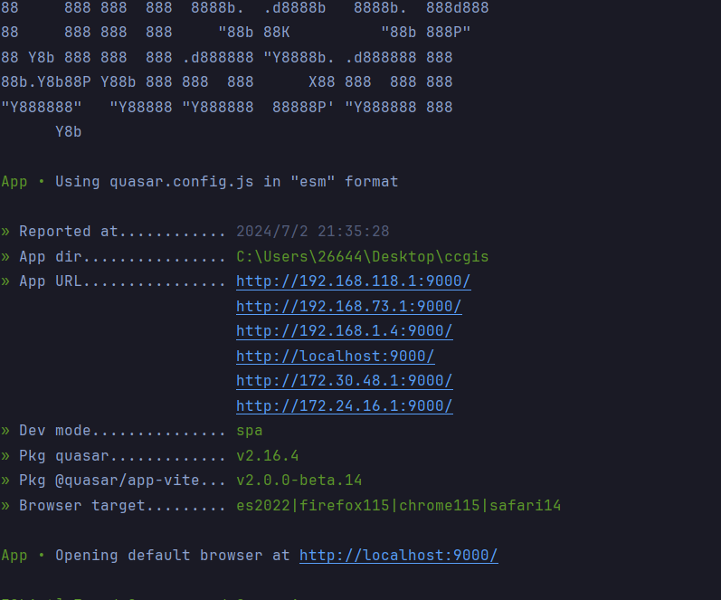
## 3. 功能介绍
### 3.1 登录
用户名：ccgis<br>
密码：123456<br>
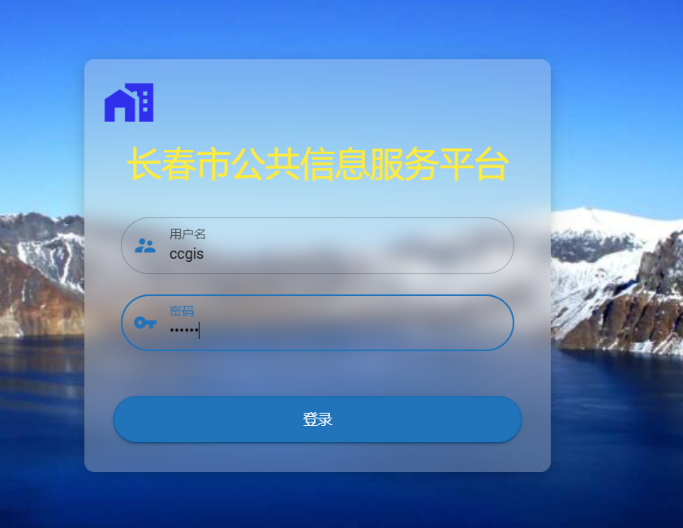
### 3.2 地图测量
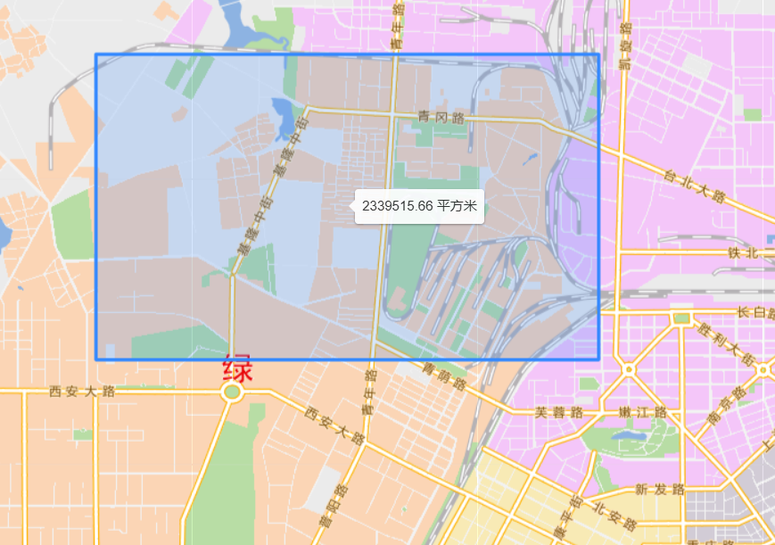
### 3.3 地图查询
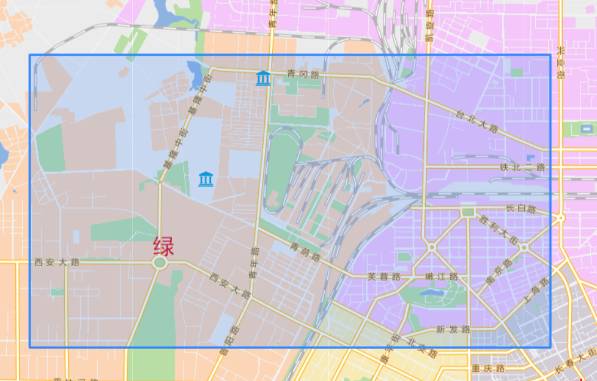
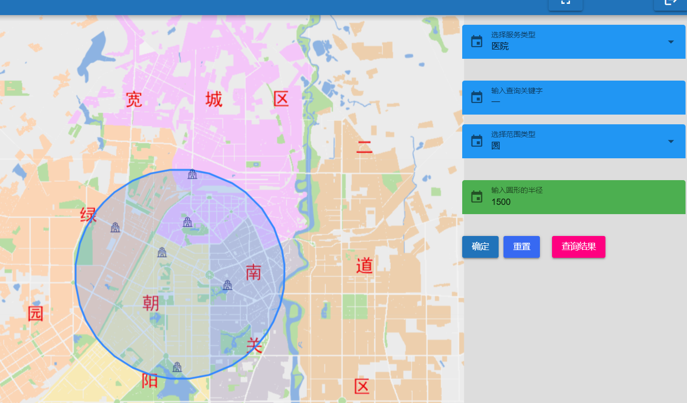
### 3.4 公交规划
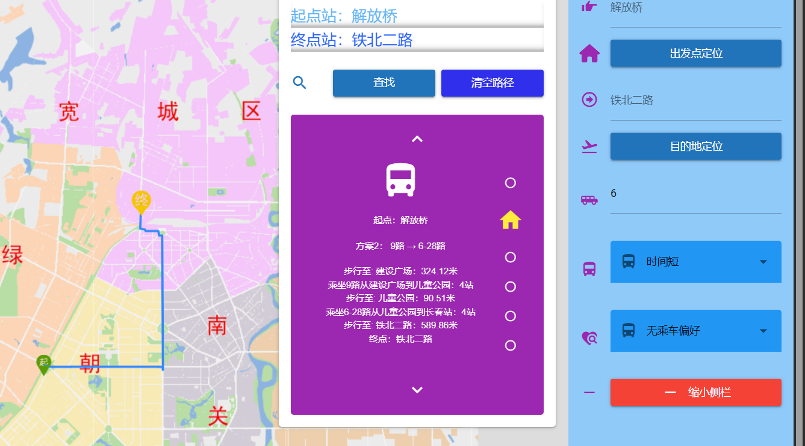
### 3.5 景点
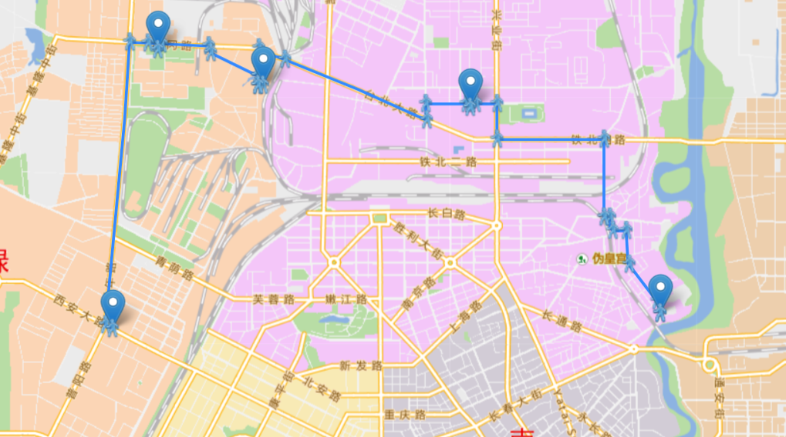]
### 3.6 求援
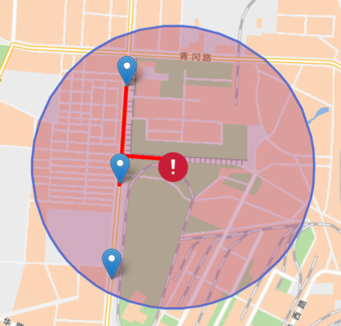
### 3.7 天气
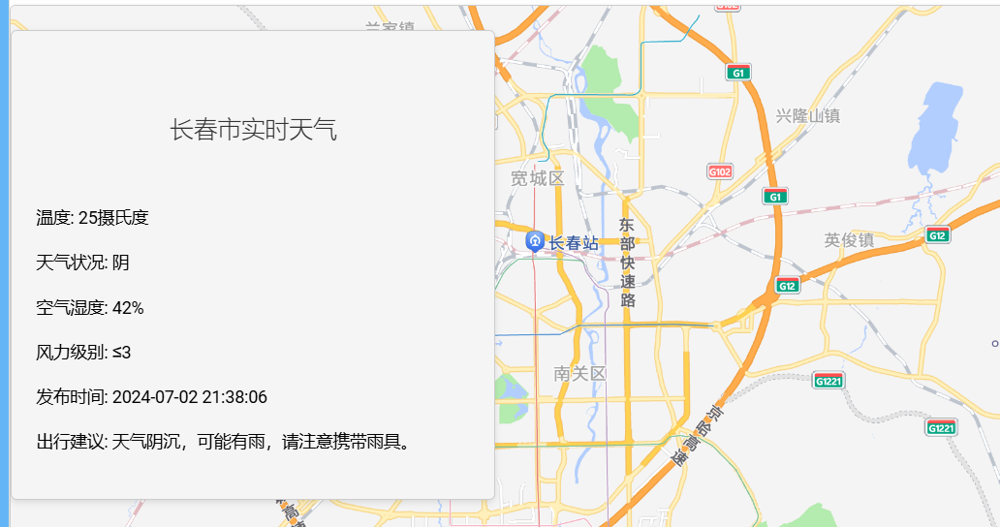
### 3.8 配置
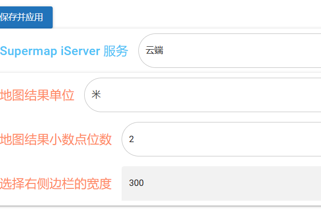
## 4 打包
### 4.1 安装sqa页面
```bash
npm run build
```
### 4.2 spa页面打包成功
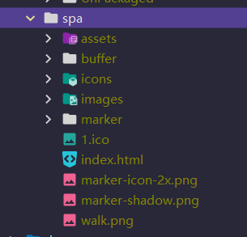
### 4.3 运行打包后的sqa页面
进入dist/spa目录，执行以下命令启动项目
```bash
quasar serve
```
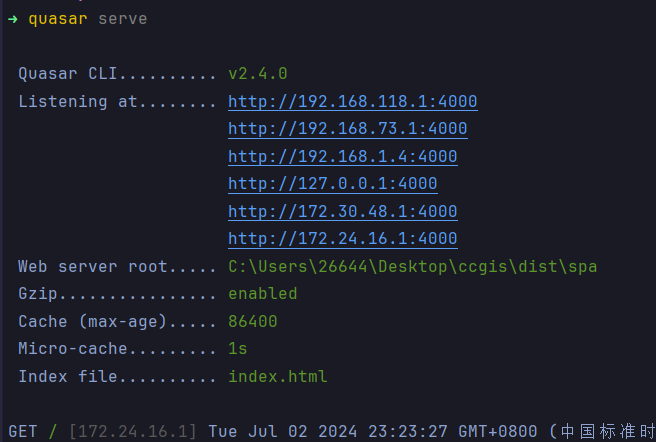
### 4.4 使用electron打包
```bash
npm run electron-build
```
### 4.5 打包成功
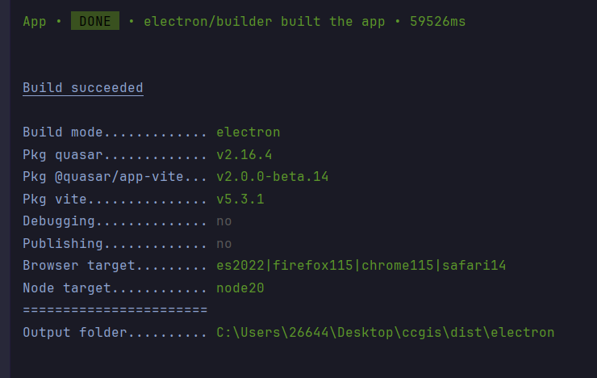
### 4.6 结果
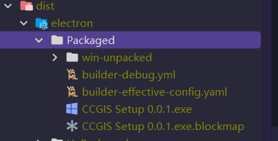
### 4.7 打包失败
可参考以下链接解决问题。
- [electron打包失败 - 解决方案1](https://blog.csdn.net/qq_59747594/article/details/132393855)
- [electron打包失败 - 解决方案2](https://blog.csdn.net/michaelxuzhi___/article/details/106568543)
## 5. 许可证
根据 MIT 许可证分发。打开 LICENSE 查看更多内容。
## 6.🌟参与贡献
- [its-hard-to-be-distracted](https://gitee.com/its-hard-to-be-distracted)
- [aaanzuij](https://gitee.com/aaanzuij)
- [red-pomelo-han](https://gitee.com/red-pomelo-han)
- [zmh7](https://gitee.com/zmh7)
- [majiesss](https://gitee.com/majiesss)
## 7. 支持项目
如果您觉得这个项目帮助到了您，欢迎给项目一个 star，您的支持是我创作的动力！
## 8. 致谢
- 感谢[SuperMap iServer](https://www.supermap.com/)提供的地图服务和数据服务。
- 感谢[Vue.js](https://cn.vuejs.org/)提供的前端框架。
- 感谢[Quasar](https://quasar.dev/)提供的Vue UI组件库。
## 9. 联系作者
- 邮箱：2664481691@qq.com


